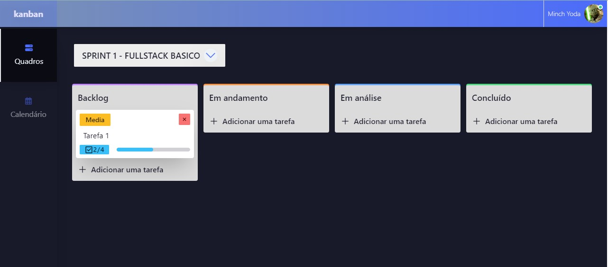

# Kanban App 

[](https://www.npmjs.com/package/vue)
[](https://www.npmjs.com/package/@vueuse/core)
[](https://www.npmjs.com/package/vue-router)
[](https://www.npmjs.com/package/pinia)
[](https://www.npmjs.com/package/axios)
[](https://www.npmjs.com/package/tailwindcss)
[](https://www.npmjs.com/package/tailwind-scrollbar)
[](https://www.npmjs.com/package/daisyui)
[](https://www.npmjs.com/package/theme-change)



> Pequena aplicação web de gestão de projetos utilizando Kanban. Desenvolvida com Vue 3, Tailwind CSS e DaisyUI. 

> Este frontend foi desenvolvido como trabalho de conclusão do segundo módulo - Desenvolvimento Frontend Avançado - da Pós-Graduação em Desenvolvimento FullStack da PUC-RIO. 

> Link para o [protótipo em alta fidelidade no Figma](https://www.figma.com/file/H1MaexkrCc6AknLQi43HqE/Kanban-App?type=design&node-id=0%3A1&mode=design&t=wljF02F4Yds8ZjUA-1)

## Funcionalidades

- [x] Listar quadros.
- [x] Criar tarefa.
- [x] Editar tarefa.
- [x] Excluir tarefa.
- [x] Adicionar sub tarefas.
- [x] Exibir informações do perfil de usuário.

## Todo
- [ ] Implementar backend real.
- [ ] Login de usuário.
- [ ] Registro de usuários.
- [ ] Criar/Editar/Arquivar quadros.
- [ ] Criar/Editar/Arquivar workflows|status.
- [ ] Arquivar tarefas.
- [ ] Associar usuários a tarefas.
- [ ] Associar usuários a sub tarefas.
- [ ] Reordenar tarefas.
- [ ] Reordenar sub tarefas.
- [ ] Arrastar tarefas entre workflows|status.
- [ ] Layout Responsivo no mobile.
- [ ] Validação nos formulários.
- [x] ~~Gerenciador de temas.~~
- [x] ~~Sistema de notificação.~~
- [x] ~~Implementar interface entre API e frontend via composables~~


## 💻 Pré-requisitos

Antes de começar, verifique se você atendeu aos seguintes requisitos:
<!---Estes são apenas requisitos de exemplo. Adicionar, duplicar ou remover conforme necessário--->
* `NodeJS`

## 🚀 Instalando

Para instalar, siga estas etapas:

Clone o repositório :
```sh
git clone https://github.com/bpbastos/kanban-app.git
```

Após clonar, instale as dependências da aplicação.

```sh
npm install
```

## ☕ Usando

Primeiro inicie o fake backend:

```sh
npm run backend
```

Em outro terminal, execute:
```sh
npm run dev
```

Abra o endereço http://localhost:5173/board no seu navegador.
